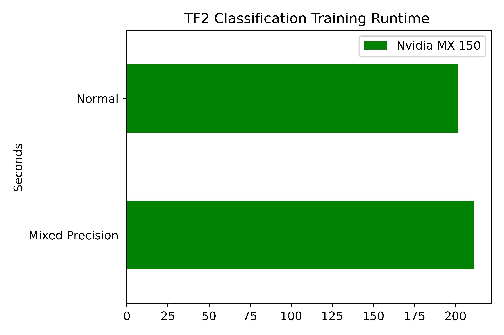
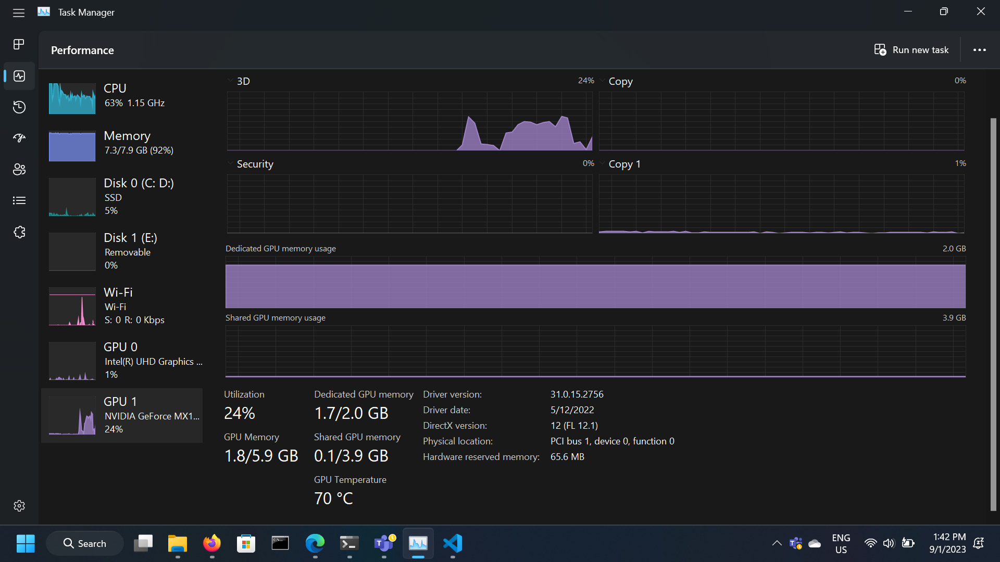
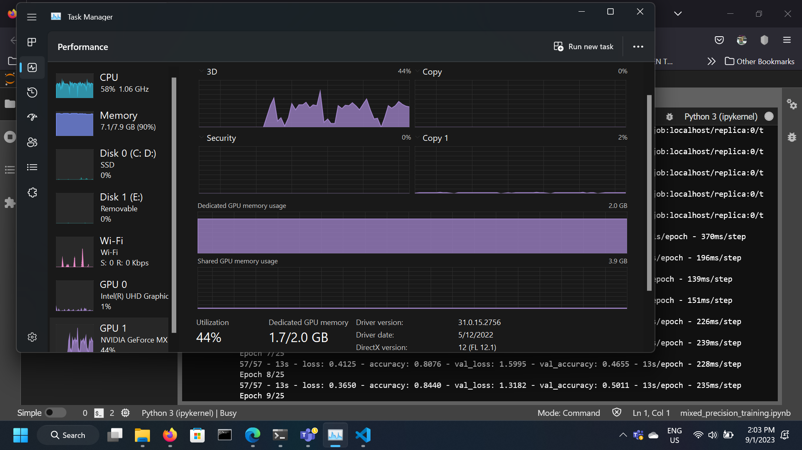

# TF Mammogram Classification

# Mixed Precision Training in Tensorflow 2.x

## Overview about mixed precision

Larger neural network models typically improves accuracy but also require more compute and memory resources to train. Many modern deep learning training systems use single-precision (FP32) format.[^1] [^3] To cater these power hungry challange, mixed precision (MP) methods arrive to save the day. It combine the use of different numerical formats in one computational workload.[^2]

To use MP, we have to use NVIDIA GPUs with Tensor Cores, which is any card with Volta architecture (or later).

---

This repository contains notebooks showing how to perform mixed precision training in `tf.keras` (TensorFlow 2.x). 

To perform mixed precision training in `tf.keras` (2.x) there are a number of options available:

- [`tf.keras.mixed_precision.Policy`](https://www.tensorflow.org/guide/mixed_precision)
- [`tf.keras.mixed_precision.LossScaleOptimizer`](https://www.tensorflow.org/guide/mixed_precision#training_the_model_with_a_custom_training_loop)

---

The method presented in this notebook is the API used in TensorFlow 2.10.1 with the following PC specification:

## Computer setup

+ Windows 11 Pro (i7-8700K @ 3.7GHz, 32GB DDR4 on NVMe)
+ python 3.8.10
+ CUDA 11.2
+ cuDNN 8.1.1

> Note: I've rerun all notebook on laptopm with MX 150.

## Installation

We recommend **Python 3.8+**  or later.

Install dependencies libraries:

```
pip install -r requirement.txt
```

[RSNA dataset](https://www.kaggle.com/competitions/rsna-breast-cancer-detection/data) is used for both [notebooks](https://github.com/knabenphysik/tf-mammogram-classification/tree/main/notebook).


## Results

Here's a mini comparison (model used: **CNN**) with `124x124` set as image size for my laptop:

| Dataset used        | With mixed precision | Without mixed precision |
|---------------------|:--------------------:|------------------------:|
| [Breast Cancer Detection](https://www.kaggle.com/competitions/rsna-breast-cancer-detection/data) |      **211.297 secs**     |       201.592 secs       |

Visualize the result:



> Note: training with MP should be faster than normal. But in my case, since MX150 doesn't have tensorflow. Training is slower a bit.


Snapshot of Windows 11 during both training session:





## Acknowledgements:
- At the time of benchmark, I used the dataset as given in [this competition](https://www.kaggle.com/competitions/rsna-breast-cancer-detection/data). The dataset comes in a different form but I adjusted it accordingly to aid my experiments. 
- linked to a wonderful resource: https://github.com/NVAITC/pycon-sg19-tensorflow-tutorial. 

## Reference

[^1]: [Mixed Precision Training](https://arxiv.org/abs/1710.03740)
[^2]: [Train With Mixed Precision](https://docs.nvidia.com/deeplearning/performance/mixed-precision-training/index.html)
[^3]: [Mixed Precision Training](https://blog.paperspace.com/mixed-precision-training-overview/)